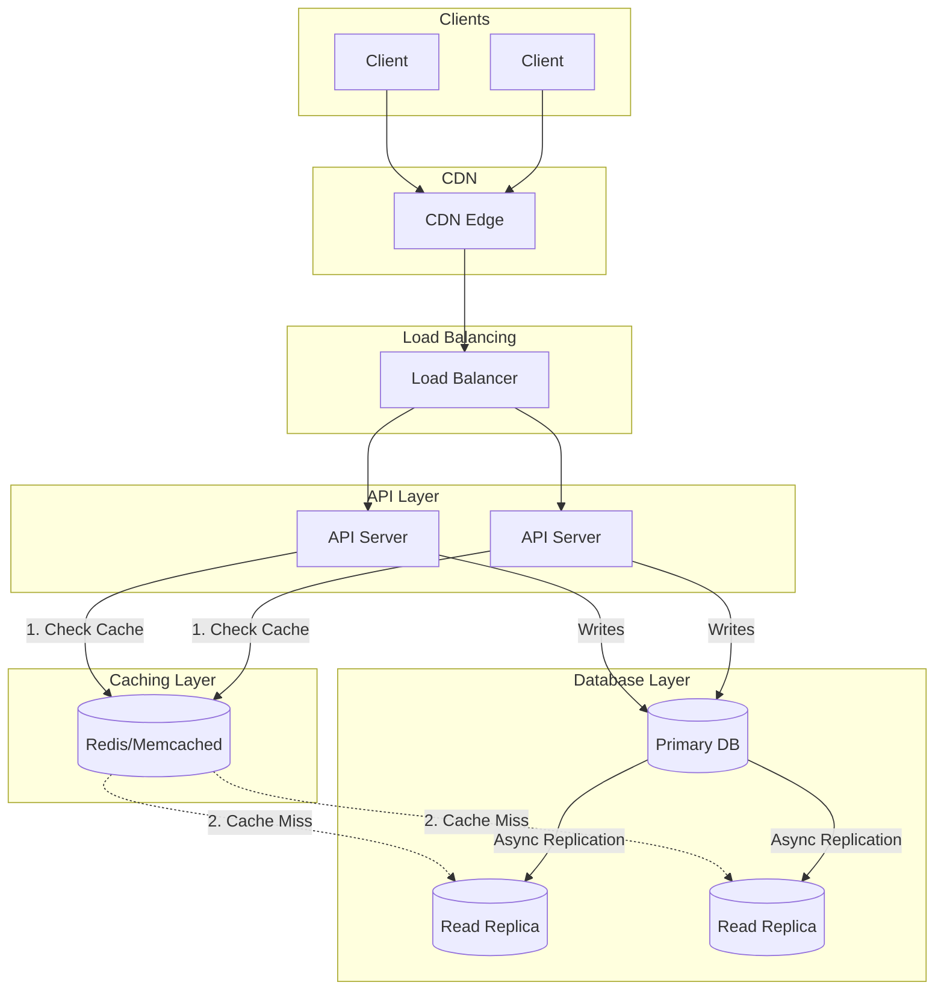
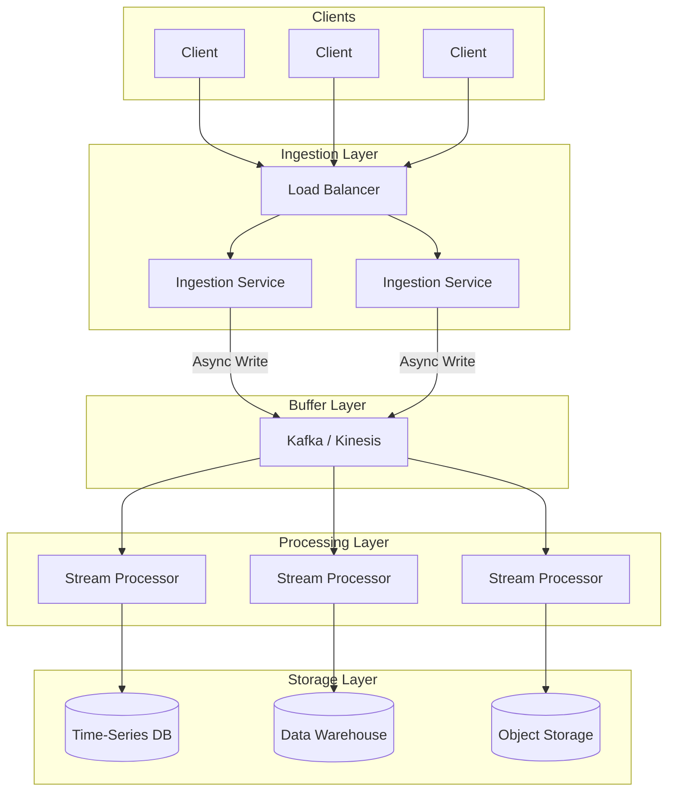
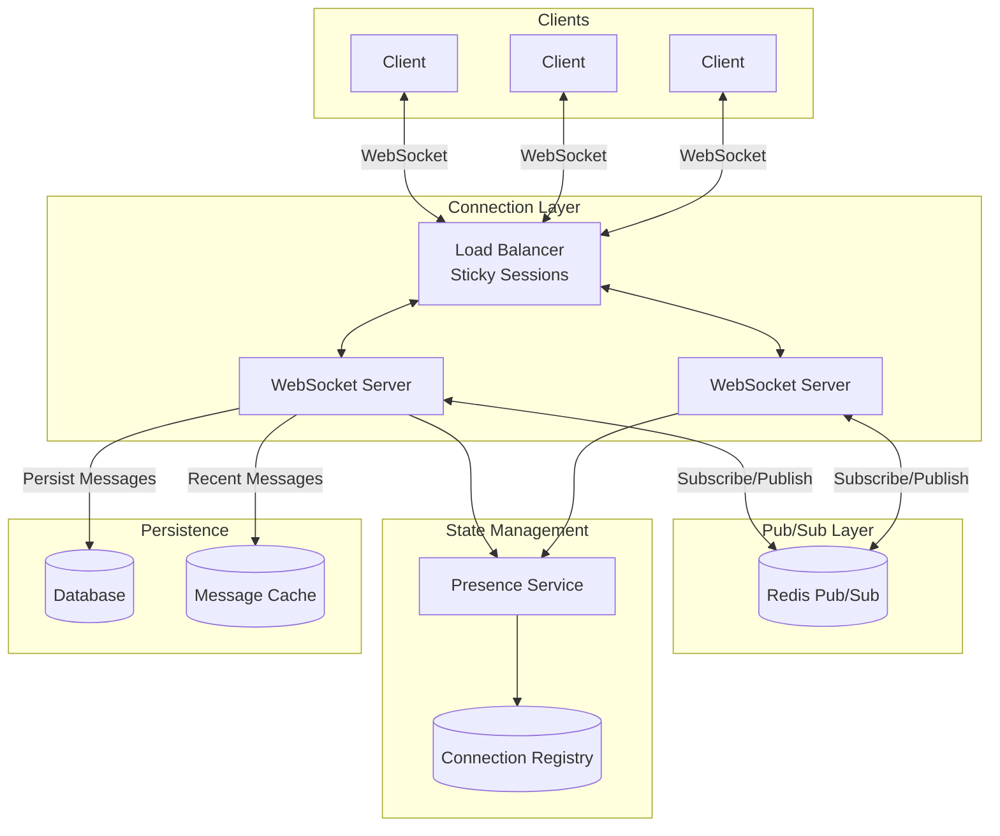
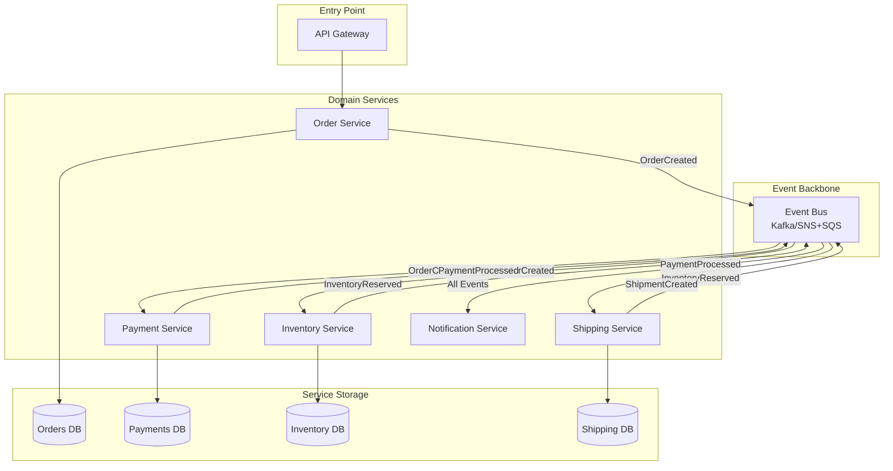
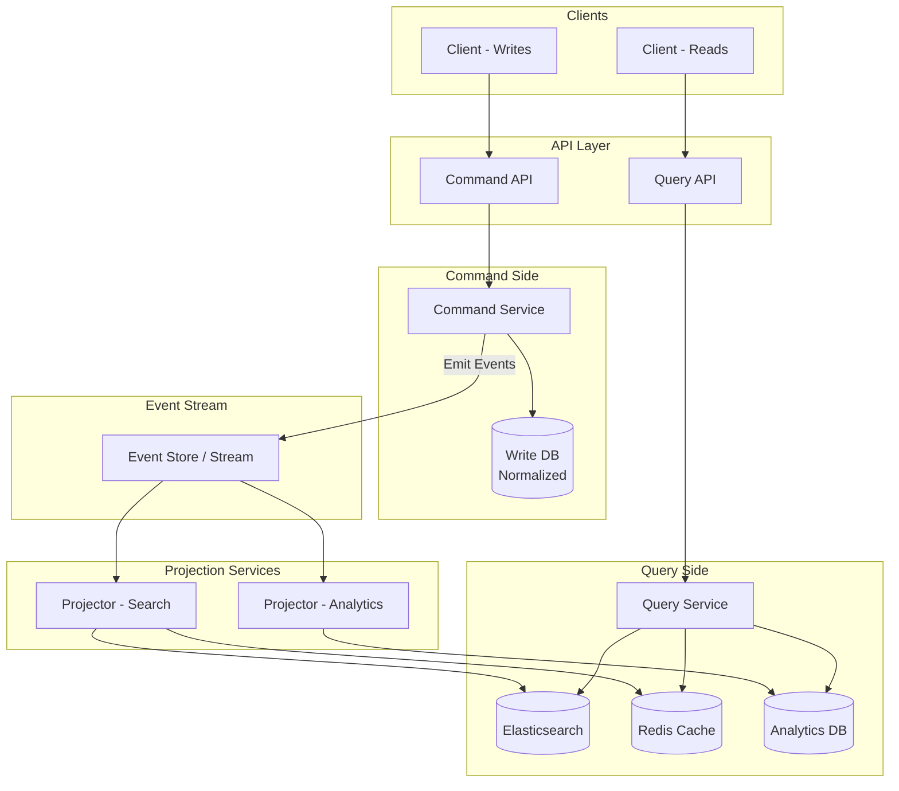
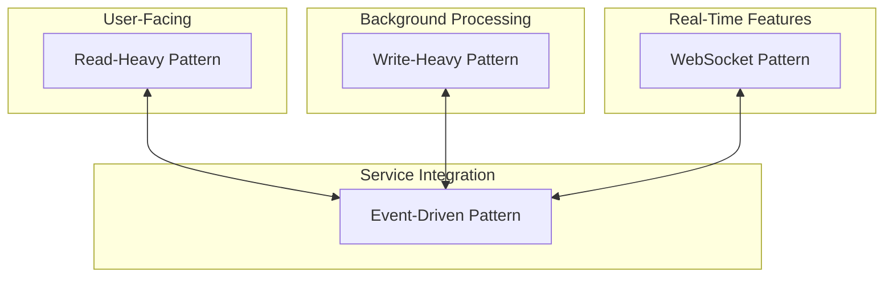

# Core System Design Patterns

A reference guide for the fundamental architectural patterns that solve most system design problems.

---

## 1. Read-Heavy Pattern (Cache-Aside + Read Replicas)

**Use when:** Read:Write ratio > 10:1  
**Examples:** Social media feeds, product catalogs, content sites, user profiles

**Key decisions:**
- Cache invalidation strategy (TTL vs event-based)
- Replication lag tolerance
- Cache warming on cold start

---

## 2. Write-Heavy Pattern (Buffered Writes + Async Processing)

**Use when:** High write throughput, eventual consistency acceptable  
**Examples:** Analytics, logging, IoT telemetry, metrics collection

**Key decisions:**
- Partition strategy for parallelism
- At-least-once vs exactly-once semantics
- Batch size and flush intervals
- Dead letter queue for failures

---

## 3. Real-Time Bidirectional Pattern (WebSocket + Pub/Sub)

**Use when:** Low-latency, bidirectional communication required  
**Examples:** Chat applications, collaborative editing, live gaming, trading platforms

**Key decisions:**
- Connection state management across servers
- Heartbeat/keepalive strategy
- Message ordering guarantees
- Reconnection and message replay

---

## 4. Event-Driven / Choreography Pattern

**Use when:** Loose coupling between services, complex workflows  
**Examples:** Order processing, payment flows, inventory management, notifications

**Key decisions:**
- Event schema evolution strategy
- Saga pattern for distributed transactions
- Idempotency for event handlers
- Dead letter handling and compensation

---

## 5. CQRS Pattern (Command Query Responsibility Segregation)

**Use when:** Read and write models have different shapes or scale requirements  
**Examples:** E-commerce search, reporting dashboards, complex domain models

**Key decisions:**
- Eventual consistency window tolerance
- Projection rebuild strategy
- Event versioning
- Read model technology per use case

---

## Quick Selection Matrix

| Pattern | Read:Write Ratio | Consistency | Latency | Complexity |
|---------|-----------------|-------------|---------|------------|
| Read-Heavy | High reads | Strong possible | Low reads | Low |
| Write-Heavy | High writes | Eventual | Async writes | Medium |
| Real-Time | Balanced | Eventual | Very low | High |
| Event-Driven | Varies | Eventual | Async | High |
| CQRS | High reads, complex writes | Eventual | Optimized per side | Very High |

---

## Combining Patterns

Most real systems combine these patterns:

**Example: Twitter-like System**
- Read-Heavy: Timeline rendering with fan-out on read
- Write-Heavy: Analytics and engagement metrics
- Real-Time: Notifications and live updates
- Event-Driven: Cross-service coordination (tweets → notifications → analytics)

---

## Interview Tips

1. **Start with requirements** - Clarify read/write ratio, latency needs, consistency requirements
2. **Name the pattern** - "This is a classic read-heavy workload, so I'll use cache-aside with read replicas"
3. **Draw the boxes first** - Get the high-level architecture before diving into specifics
4. **Justify tool choices** - "I'd use Kafka here because we need replay capability and high throughput"
5. **Discuss tradeoffs** - Every choice has costs; show you understand them