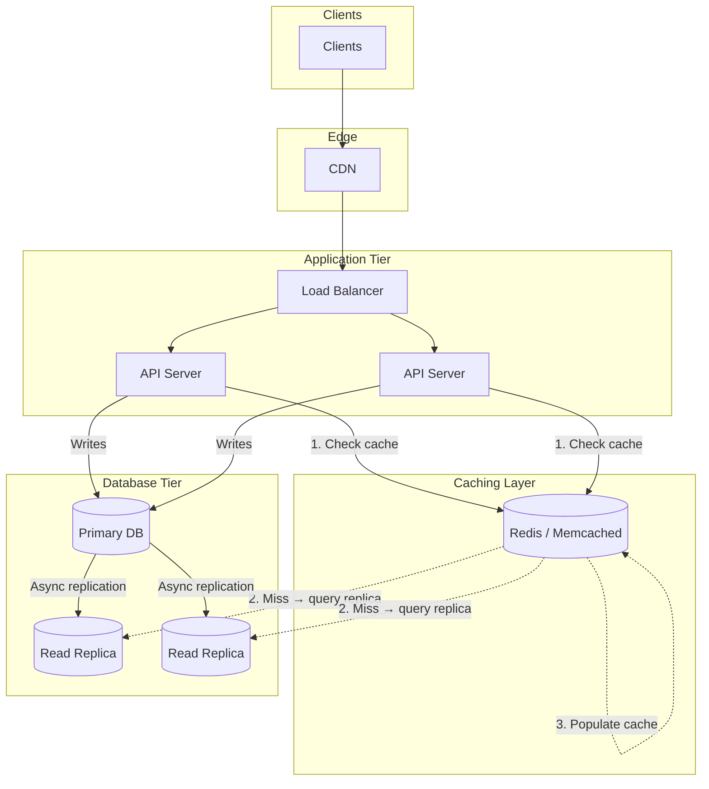
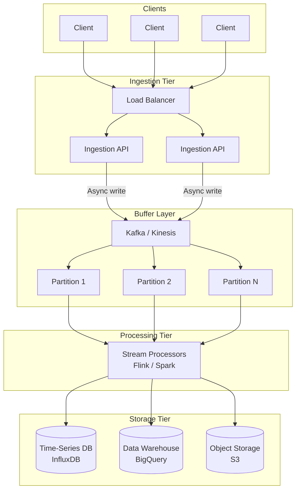
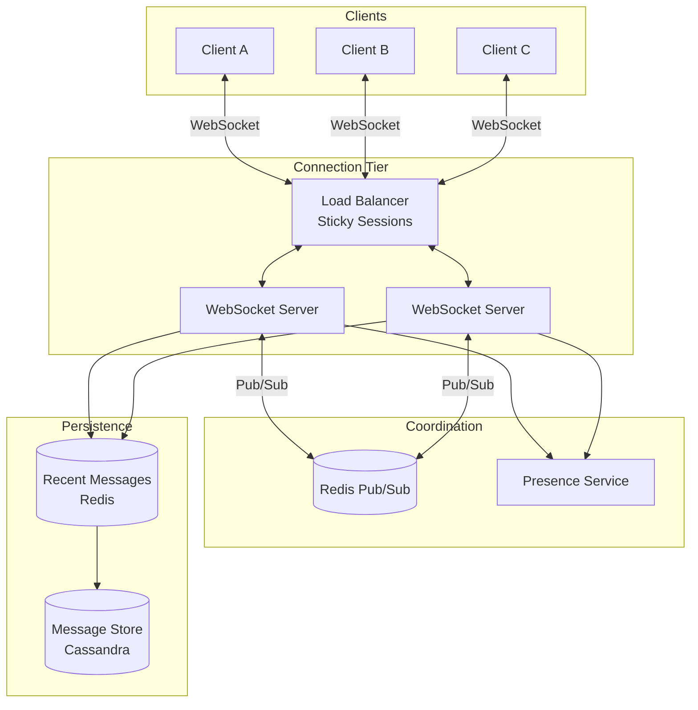
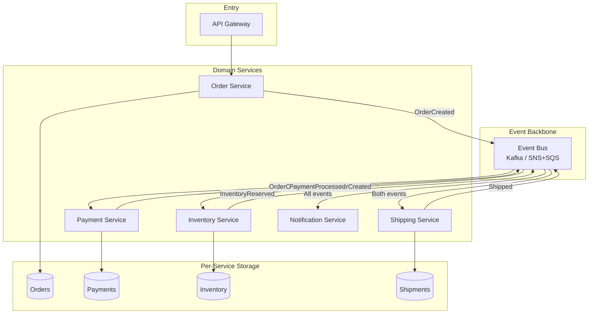
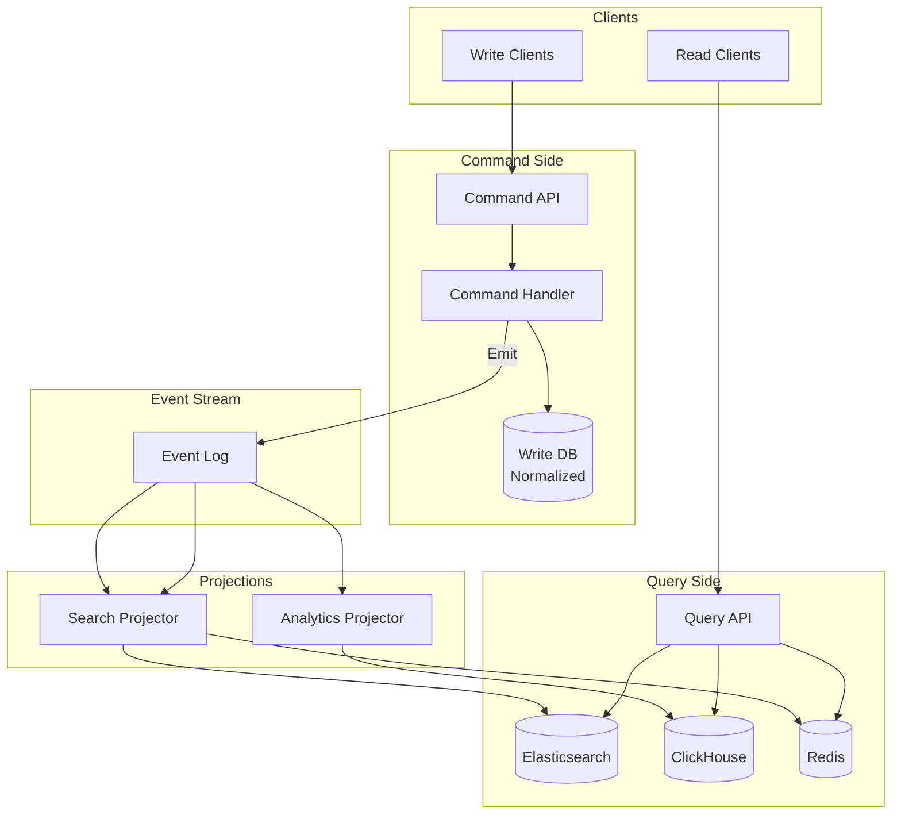
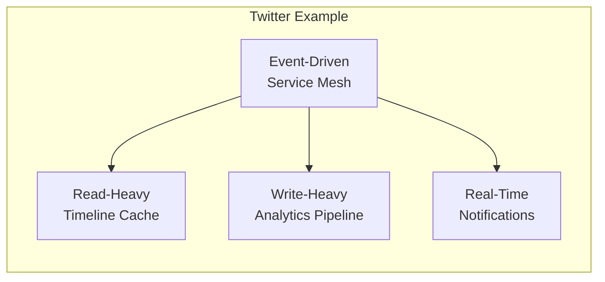

# System Design Patterns: Interview Reference

There are only a handful of fundamental architectural patterns that solve most system design problems. This repo distills them into quick-reference diagrams you can internalize before interviews.

## Pattern Selection Matrix

| Pattern | When to Use | Read:Write | Consistency | Latency |
|---------|-------------|------------|-------------|---------|
| [Read-Heavy](#1-read-heavy-pattern) | Reads dominate (>10:1) | High reads | Strong possible | Low reads |
| [Write-Heavy](#2-write-heavy-pattern) | High ingestion, eventual OK | High writes | Eventual | Async writes |
| [Real-Time](#3-real-time-bidirectional-pattern) | Live updates required | Balanced | Eventual | Very low |
| [Event-Driven](#4-event-driven-pattern) | Service coordination | Varies | Eventual | Async |
| [CQRS](#5-cqrs-pattern) | Read/write models diverge | Complex | Eventual | Optimized |

**Interview tip:** Start every answer by identifying which pattern fits, then justify your choice.

---

## 1. Read-Heavy Pattern

**The shape:** Cache-aside + read replicas  
**Use when:** Social feeds, product catalogs, user profiles, content sites  
**Read:Write ratio:** >10:1

### Key Decisions to Discuss

| Decision | Options | Tradeoff |
|----------|---------|----------|
| Cache invalidation | TTL vs event-based | Simplicity vs freshness |
| Replication | Sync vs async | Consistency vs write latency |
| Cache warming | Eager vs lazy | Startup time vs complexity |

### What Interviewers Want to Hear

- "I'd use cache-aside because it handles cache failures gracefully—we fall back to the replica"
- "With async replication, we accept ~100ms staleness for 10x read throughput"
- "Cache hit rate target is 95%+; below that, we're just adding latency"

---

## 2. Write-Heavy Pattern

**The shape:** Buffer → async process → optimized storage  
**Use when:** Analytics, logging, IoT telemetry, metrics, event tracking  
**Write:Read ratio:** >5:1 or bursty writes

### Key Decisions to Discuss

| Decision | Options | Tradeoff |
|----------|---------|----------|
| Delivery guarantee | At-least-once vs exactly-once | Throughput vs complexity |
| Partitioning | Hash vs range vs random | Hot spots vs ordering |
| Batch size | Small vs large | Latency vs throughput |

### What Interviewers Want to Hear

- "Kafka gives us replay capability—if a consumer dies, we reprocess from offset"
- "Partitioning by user_id keeps related events ordered but risks hot partitions for power users"
- "We batch writes to the warehouse in 1-minute windows to reduce costs"

---

## 3. Real-Time Bidirectional Pattern

**The shape:** WebSockets + pub/sub fan-out  
**Use when:** Chat, collaboration, gaming, live dashboards, trading  
**Key requirement:** Sub-second latency, bidirectional

### Key Decisions to Discuss

| Decision | Options | Tradeoff |
|----------|---------|----------|
| Connection routing | Sticky vs stateless | Simplicity vs failover |
| Message ordering | Per-channel vs global | Correctness vs performance |
| Offline handling | Queue vs drop | Completeness vs resource use |

### What Interviewers Want to Hear

- "Redis pub/sub lets Server A notify Server B's clients without direct coupling"
- "Sticky sessions simplify state but we need connection draining for deploys"
- "On reconnect, client sends last message ID; we replay from the cache"

---

## 4. Event-Driven Pattern

**The shape:** Services emit events, others react (choreography)  
**Use when:** Order flows, payments, inventory, notifications, microservices  
**Key requirement:** Loose coupling, complex workflows

### Key Decisions to Discuss

| Decision | Options | Tradeoff |
|----------|---------|----------|
| Coordination | Choreography vs orchestration | Autonomy vs visibility |
| Failures | Saga compensation vs 2PC | Availability vs consistency |
| Idempotency | Event ID dedup | Exactly-once semantics |

### What Interviewers Want to Hear

- "Choreography means no central coordinator—services react independently"
- "For payment failures, we use a saga: emit PaymentFailed, Inventory listens and releases reservation"
- "Every handler checks event ID to ensure idempotent processing"

---

## 5. CQRS Pattern

**The shape:** Separate read and write models  
**Use when:** Search over transactional data, complex reporting, different scaling needs  
**Key requirement:** Read and write shapes diverge significantly

### Key Decisions to Discuss

| Decision | Options | Tradeoff |
|----------|---------|----------|
| Consistency window | Seconds vs minutes | UX vs complexity |
| Projection rebuild | Replay all vs snapshot | Recovery time vs storage |
| Event schema | Versioned vs flexible | Evolution vs validation |

### What Interviewers Want to Hear

- "CQRS lets us scale reads and writes independently with different tech"
- "The search index is eventually consistent—typically 2-3 seconds behind"
- "If we need to change the read model, we replay events to rebuild the projection"

---

## Combining Patterns (Real Systems)

Most production systems combine multiple patterns:

| System | Primary Pattern | Secondary Patterns |
|--------|-----------------|-------------------|
| Twitter | Read-Heavy (timelines) | Write-Heavy (analytics), Real-Time (notifications) |
| Uber | Real-Time (location) | Event-Driven (ride flow), Write-Heavy (telemetry) |
| Shopify | CQRS (catalog + orders) | Event-Driven (fulfillment), Read-Heavy (storefront) |

---

## Interview Framework

### Step 1: Clarify Requirements (2 min)
- Read vs write ratio?
- Latency requirements?
- Consistency needs?
- Scale (QPS, data size)?

### Step 2: Identify Pattern (1 min)
> "This is a read-heavy workload with a 100:1 read/write ratio, so I'll use cache-aside with read replicas."

### Step 3: Draw High-Level (5 min)
- Boxes first, arrows second
- Name the components generically, then specific tools

### Step 4: Deep Dive (10 min)
- Pick 2-3 components to detail
- Discuss tradeoffs unprompted
- Mention failure modes

### Step 5: Scale & Extend (5 min)
- "At 10x scale, I'd add..."
- "For global users, I'd introduce..."

---

## Quick Reference: Tool Selection

| Need | Options | When to Choose |
|------|---------|----------------|
| Cache | Redis vs Memcached | Redis if you need data structures; Memcached for pure K/V |
| Queue | Kafka vs SQS vs RabbitMQ | Kafka for replay/streaming; SQS for simplicity; Rabbit for routing |
| Search | Elasticsearch vs Algolia | ES for control; Algolia for speed-to-market |
| Time-series | InfluxDB vs TimescaleDB | InfluxDB for metrics; Timescale if you need SQL |
| Write-optimized DB | Cassandra vs ScyllaDB | Scylla for lower latency; Cassandra for ecosystem |

---

## Further Reading

- [System Design Primer](https://github.com/donnemartin/system-design-primer) — Comprehensive GitHub resource
- [ByteByteGo](https://bytebytego.com) — Visual system design guides
- [Hello Interview Patterns](https://www.hellointerview.com/learn/system-design/in-a-hurry/patterns) — Interview-focused patterns
- [DesignGurus.io](https://www.designgurus.io/blog/read-heavy-vs-write-heavy) — Workload optimization guides
