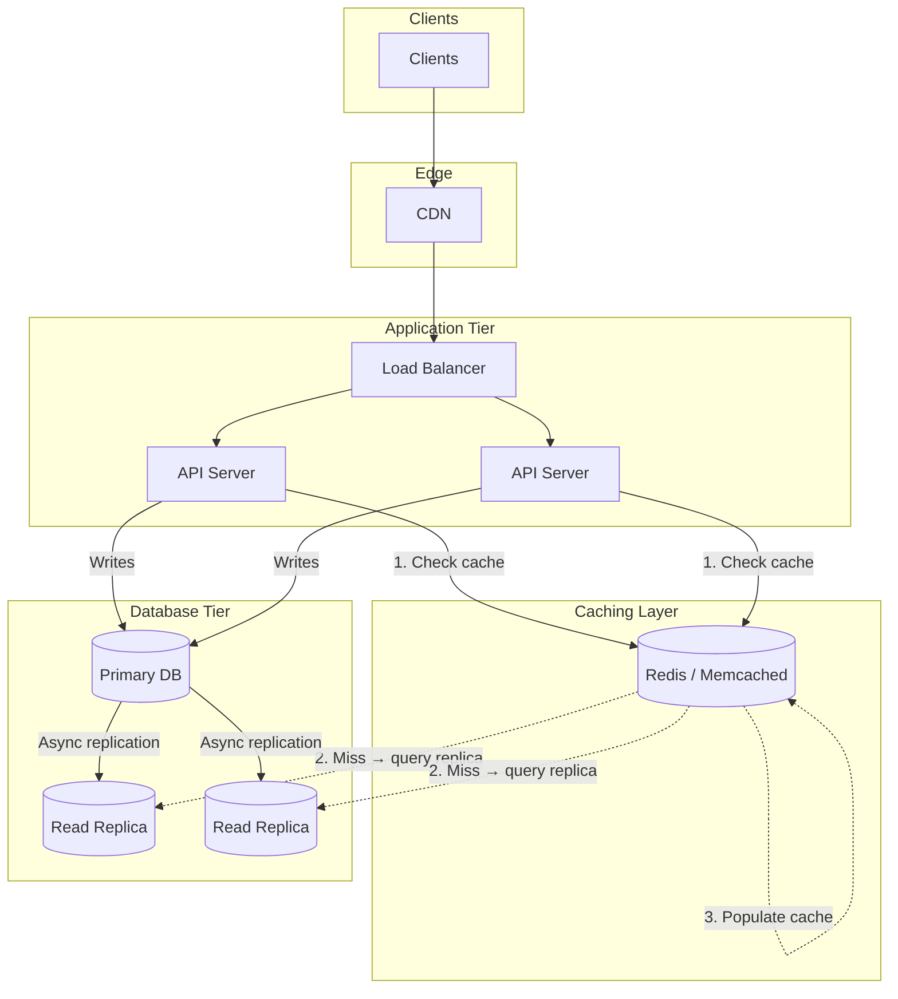
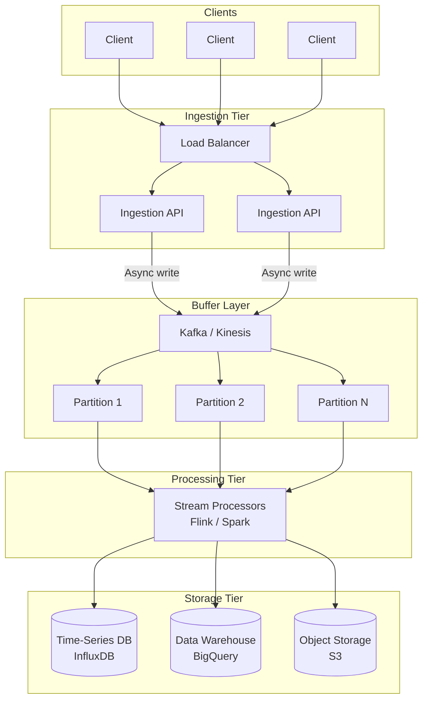
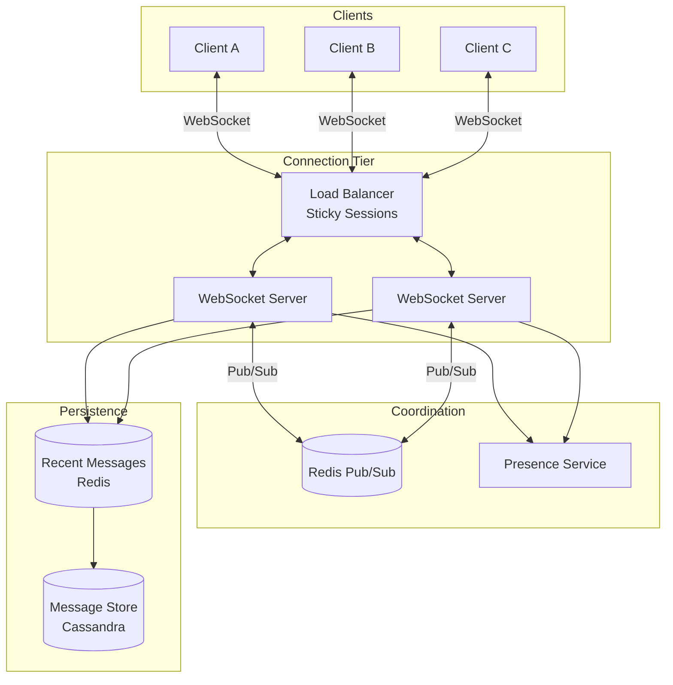
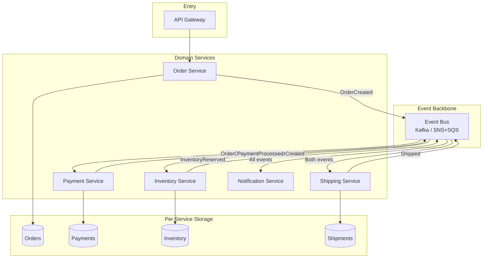
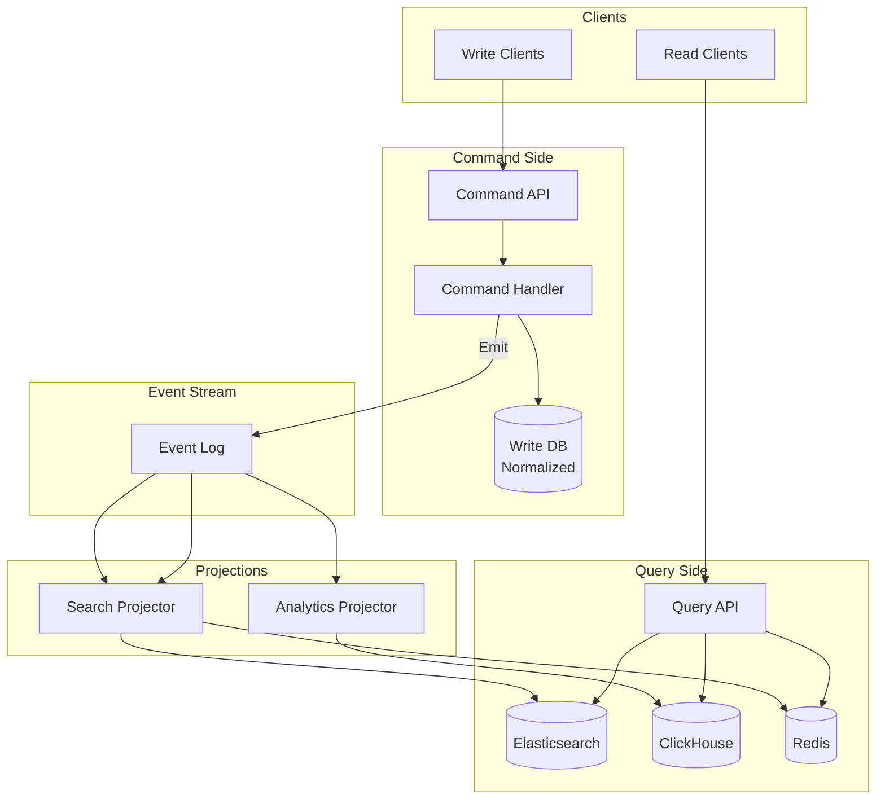
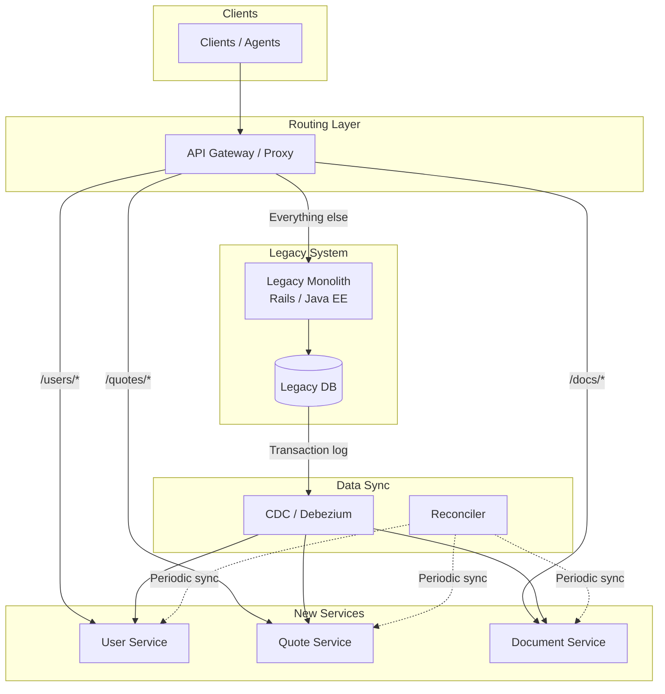
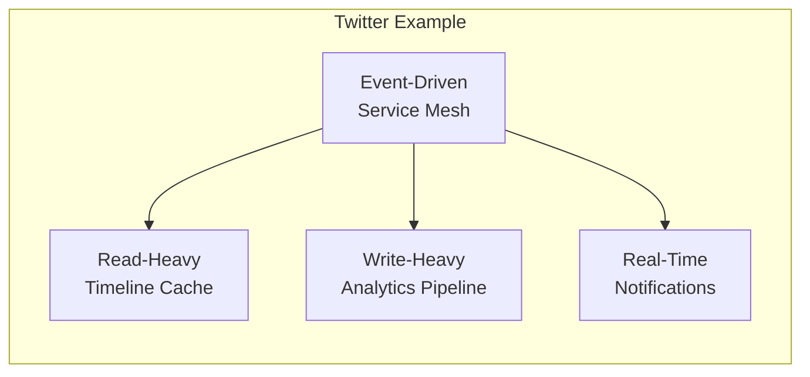

# System Design Patterns: Interview Reference

There are only a handful of fundamental architectural patterns that solve most system design problems. This repo distills them into quick-reference diagrams you can internalize before interviews.

## Pattern Selection Matrix

| Pattern | When to Use | Read:Write | Consistency | Latency |
|---------|-------------|------------|-------------|---------|
| [Read-Heavy](#1-read-heavy-pattern) | Reads dominate (>10:1) | High reads | Strong possible | Low reads |
| [Write-Heavy](#2-write-heavy-pattern) | High ingestion, eventual OK | High writes | Eventual | Async writes |
| [Real-Time](#3-real-time-bidirectional-pattern) | Live updates required | Balanced | Eventual | Very low |
| [Event-Driven](#4-event-driven-pattern) | Service coordination | Varies | Eventual | Async |
| [CQRS](#5-cqrs-pattern) | Read/write models diverge | Complex | Eventual | Optimized |
| [Strangler Fig](#6-strangler-fig-pattern) | Monolith → microservices | Varies | Dual-system | Proxy overhead |

**Interview tip:** Start every answer by identifying which pattern fits, then justify your choice.

---

## 1. Read-Heavy Pattern

**The shape:** Cache-aside + read replicas  
**Use when:** Social feeds, product catalogs, user profiles, content sites  
**Read:Write ratio:** >10:1



### Key Decisions to Discuss

| Decision | Options | Tradeoff |
|----------|---------|----------|
| Cache invalidation | TTL vs event-based | Simplicity vs freshness |
| Replication | Sync vs async | Consistency vs write latency |
| Cache warming | Eager vs lazy | Startup time vs complexity |

### What Interviewers Want to Hear

- "I'd use cache-aside because it handles cache failures gracefully—we fall back to the replica"
- "With async replication, we accept ~100ms staleness for 10x read throughput"
- "Cache hit rate target is 95%+; below that, we're just adding latency"

---

## 2. Write-Heavy Pattern

**The shape:** Buffer → async process → optimized storage  
**Use when:** Analytics, logging, IoT telemetry, metrics, event tracking  
**Write:Read ratio:** >5:1 or bursty writes



### Key Decisions to Discuss

| Decision | Options | Tradeoff |
|----------|---------|----------|
| Delivery guarantee | At-least-once vs exactly-once | Throughput vs complexity |
| Partitioning | Hash vs range vs random | Hot spots vs ordering |
| Batch size | Small vs large | Latency vs throughput |

### What Interviewers Want to Hear

- "Kafka gives us replay capability—if a consumer dies, we reprocess from offset"
- "Partitioning by user_id keeps related events ordered but risks hot partitions for power users"
- "We batch writes to the warehouse in 1-minute windows to reduce costs"

---

## 3. Real-Time Bidirectional Pattern

**The shape:** WebSockets + pub/sub fan-out  
**Use when:** Chat, collaboration, gaming, live dashboards, trading  
**Key requirement:** Sub-second latency, bidirectional



### Key Decisions to Discuss

| Decision | Options | Tradeoff |
|----------|---------|----------|
| Connection routing | Sticky vs stateless | Simplicity vs failover |
| Message ordering | Per-channel vs global | Correctness vs performance |
| Offline handling | Queue vs drop | Completeness vs resource use |

### What Interviewers Want to Hear

- "Redis pub/sub lets Server A notify Server B's clients without direct coupling"
- "Sticky sessions simplify state but we need connection draining for deploys"
- "On reconnect, client sends last message ID; we replay from the cache"

---

## 4. Event-Driven Pattern

**The shape:** Services emit events, others react (choreography)  
**Use when:** Order flows, payments, inventory, notifications, microservices  
**Key requirement:** Loose coupling, complex workflows



### Key Decisions to Discuss

| Decision | Options | Tradeoff |
|----------|---------|----------|
| Coordination | Choreography vs orchestration | Autonomy vs visibility |
| Failures | Saga compensation vs 2PC | Availability vs consistency |
| Idempotency | Event ID dedup | Exactly-once semantics |

### What Interviewers Want to Hear

- "Choreography means no central coordinator—services react independently"
- "For payment failures, we use a saga: emit PaymentFailed, Inventory listens and releases reservation"
- "Every handler checks event ID to ensure idempotent processing"

---

## 5. CQRS Pattern

**The shape:** Separate read and write models  
**Use when:** Search over transactional data, complex reporting, different scaling needs  
**Key requirement:** Read and write shapes diverge significantly



### Key Decisions to Discuss

| Decision | Options | Tradeoff |
|----------|---------|----------|
| Consistency window | Seconds vs minutes | UX vs complexity |
| Projection rebuild | Replay all vs snapshot | Recovery time vs storage |
| Event schema | Versioned vs flexible | Evolution vs validation |

### What Interviewers Want to Hear

- "CQRS lets us scale reads and writes independently with different tech"
- "The search index is eventually consistent—typically 2-3 seconds behind"
- "If we need to change the read model, we replay events to rebuild the projection"

---

## 6. Strangler Fig Pattern

> Reference: [Martin Fowler's Strangler Fig Application](https://martinfowler.com/bliki/StranglerFigApplication.html)

**The shape:** Proxy layer incrementally routes traffic from monolith to new services
**Use when:** Legacy modernization, monolith decomposition, risk-averse migrations
**Key requirement:** Zero-downtime migration with rollback capability



### Data Synchronization Strategies

| Requirement | Pattern | Notes |
|------------|---------|-------|
| Real-time, can't modify monolith | **CDC (Debezium)** | Reads DB transaction log |
| Real-time, can modify monolith | **Outbox Pattern** | Transactional guarantee |
| Simple case, accept some risk | **Dual Write** | Write to both DBs; failure risk |
| Batch/reporting | **Reconciler** | Periodic sync, handles complexity |

### Key Decisions to Discuss

| Decision | Options | Tradeoff |
|----------|---------|----------|
| Extraction order | Low-risk first vs high-value first | Confidence building vs quick wins |
| Data ownership | Shared DB vs per-service DB | Simplicity vs autonomy |
| Sync mechanism | CDC vs dual-write vs API calls | Consistency vs complexity |
| Rollback strategy | Feature flags vs DNS routing | Speed vs granularity |

### What Interviewers Want to Hear

- "I'd start with low-risk, well-bounded domains like document generation to build team confidence and prove out our CI/CD patterns"
- "The proxy layer gives us rollback capability—if the new service fails, we route traffic back to the monolith instantly"
- "For data sync, CDC with Debezium watches the Postgres transaction log without modifying the legacy system"
- "The Anti-Corruption Layer translates between old and new interfaces so we don't pollute the new services with legacy concepts"

### Migration Sequence

1. **Add proxy layer** in front of monolith (API Gateway, NGINX, or AWS Refactor Spaces)
2. **Identify bounded context** — start with low-risk, well-isolated features
3. **Extract service** — implement new service with its own database
4. **Sync data** — CDC or reconciler keeps both systems consistent
5. **Route traffic** — proxy sends requests to new service based on path/feature flags
6. **Validate** — run both systems in parallel, compare results
7. **Decommission** — remove feature from monolith once stable
8. **Repeat** — continue until monolith is fully decomposed

---

## Combining Patterns (Real Systems)

Most production systems combine multiple patterns:



| System | Primary Pattern | Secondary Patterns |
|--------|-----------------|-------------------|
| Twitter | Read-Heavy (timelines) | Write-Heavy (analytics), Real-Time (notifications) |
| Uber | Real-Time (location) | Event-Driven (ride flow), Write-Heavy (telemetry) |
| Shopify | CQRS (catalog + orders) | Event-Driven (fulfillment), Read-Heavy (storefront) |

---

## Interview Framework

### Step 1: Clarify Requirements (2 min)
- Read vs write ratio?
- Latency requirements?
- Consistency needs?
- Scale (QPS, data size)?

### Step 2: Identify Pattern (1 min)
> "This is a read-heavy workload with a 100:1 read/write ratio, so I'll use cache-aside with read replicas."

### Step 3: Draw High-Level (5 min)
- Boxes first, arrows second
- Name the components generically, then specific tools

### Step 4: Deep Dive (10 min)
- Pick 2-3 components to detail
- Discuss tradeoffs unprompted
- Mention failure modes

### Step 5: Scale & Extend (5 min)
- "At 10x scale, I'd add..."
- "For global users, I'd introduce..."

---

## Technology Reference by Layer

This section covers the major tools you'll encounter in system design interviews, organized by architectural layer. For each tool, know **what it is**, **when to use it**, and **what to say in interviews**.

### Load Balancing & API Gateway

| Tool | What It Is | When to Use | Interview Sound Bite |
|------|------------|-------------|---------------------|
| **NGINX** | High-performance reverse proxy/LB | General-purpose web traffic, SSL termination | "NGINX for L7 load balancing with SSL termination and static file serving" |
| **HAProxy** | TCP/HTTP load balancer | High-throughput, low-latency requirements | "HAProxy when we need raw performance and advanced health checks" |
| **AWS ALB** | Managed L7 load balancer | AWS-native, content-based routing | "ALB for path-based routing to different microservices" |
| **AWS NLB** | Managed L4 load balancer | Ultra-low latency, TCP/UDP traffic | "NLB for WebSocket connections—it preserves client IP" |
| **Kong / Apigee** | API Gateway | Rate limiting, auth, request transformation | "Kong at the edge for rate limiting and API key validation" |
| **Envoy** | Service mesh proxy | Service-to-service traffic, observability | "Envoy sidecars for mTLS and distributed tracing between services" |

### Caching Layer

| Tool | What It Is | When to Use | Interview Sound Bite |
|------|------------|-------------|---------------------|
| **Redis** | In-memory data structure store | Sessions, leaderboards, pub/sub, complex caching | "Redis for cache with TTL, plus pub/sub for real-time invalidation" |
| **Memcached** | Simple in-memory K/V cache | Pure caching, no persistence needed | "Memcached when we just need simple K/V with minimal overhead" |
| **CDN (CloudFront/Fastly)** | Edge caching network | Static assets, geographic distribution | "CloudFront for static assets—reduces origin load by 90%" |
| **Varnish** | HTTP accelerator | Dynamic content caching at origin | "Varnish in front of the API for cacheable GET requests" |

**Redis vs Memcached Decision:**
```
Need data structures (lists, sets, sorted sets)? → Redis
Need pub/sub? → Redis  
Need persistence? → Redis
Just need simple K/V cache? → Memcached (slightly faster, multi-threaded)
```

### Message Queues & Streaming

| Tool | What It Is | When to Use | Interview Sound Bite |
|------|------------|-------------|---------------------|
| **Kafka** | Distributed event streaming | High-throughput, replay needed, event sourcing | "Kafka for the event backbone—we need replay capability and ordering" |
| **AWS SQS** | Managed message queue | Simple async processing, no replay needed | "SQS for fire-and-forget tasks—fully managed, scales automatically" |
| **RabbitMQ** | Traditional message broker | Complex routing, multiple consumers, RPC | "RabbitMQ when we need topic exchanges and dead-letter routing" |
| **AWS Kinesis** | Managed streaming | Real-time analytics, AWS-native streaming | "Kinesis for real-time clickstream processing into Redshift" |
| **Redis Streams** | Lightweight streaming | Simpler streaming needs, already using Redis | "Redis Streams for lightweight event sourcing without Kafka overhead" |
| **AWS SNS** | Pub/sub notification service | Fan-out to multiple subscribers | "SNS to fan out events to multiple SQS queues per consumer" |

**Queue Selection Decision Tree:**
```
Need replay / event sourcing? → Kafka
Need complex routing logic? → RabbitMQ
Just need simple async? → SQS
Real-time + AWS native? → Kinesis
Fan-out to multiple consumers? → SNS + SQS
```

### Databases — Relational (OLTP)

| Tool | What It Is | When to Use | Interview Sound Bite |
|------|------------|-------------|---------------------|
| **PostgreSQL** | Advanced open-source RDBMS | Complex queries, ACID, JSON support | "Postgres for transactional data—ACID compliance and rich query support" |
| **MySQL** | Popular open-source RDBMS | Web apps, read replicas, proven scale | "MySQL with read replicas—battle-tested at massive scale" |
| **AWS Aurora** | Cloud-native MySQL/Postgres | Auto-scaling, high availability | "Aurora for 5x throughput over MySQL with automatic failover" |
| **CockroachDB** | Distributed SQL | Global scale with ACID, no sharding logic | "CockroachDB when we need geo-distributed ACID without manual sharding" |
| **Vitess** | MySQL sharding middleware | Shard MySQL horizontally | "Vitess to shard MySQL—YouTube scaled this way" |

### Databases — NoSQL

| Tool | What It Is | When to Use | Interview Sound Bite |
|------|------------|-------------|---------------------|
| **MongoDB** | Document store | Flexible schemas, rapid iteration | "MongoDB for the catalog—schema flexibility for varied product types" |
| **DynamoDB** | Managed K/V + document | Predictable latency, serverless scale | "DynamoDB for single-digit ms latency at any scale—pay per request" |
| **Cassandra** | Wide-column store | Write-heavy, time-series, high availability | "Cassandra for write-heavy workloads—linear scaling, no single point of failure" |
| **ScyllaDB** | Cassandra-compatible, faster | Cassandra use cases with lower latency | "ScyllaDB for Cassandra API with 10x lower p99 latency" |
| **Redis (persistence)** | In-memory with persistence | Hot data that needs durability | "Redis with AOF persistence for session store with fast recovery" |

**NoSQL Selection Decision Tree:**
```
Flexible documents, developer velocity? → MongoDB
Predictable latency, AWS-native? → DynamoDB
Write-heavy, time-series? → Cassandra / ScyllaDB
Key-value with data structures? → Redis
Wide column, analytics? → Cassandra
```

### Databases — Analytical (OLAP)

| Tool | What It Is | When to Use | Interview Sound Bite |
|------|------------|-------------|---------------------|
| **ClickHouse** | Column-oriented OLAP | Real-time analytics, fast aggregations | "ClickHouse for real-time dashboards—sub-second queries on billions of rows" |
| **BigQuery** | Serverless data warehouse | Ad-hoc analytics, GCP-native | "BigQuery for analytics—serverless, pay per query, handles petabytes" |
| **Redshift** | AWS data warehouse | Structured analytics, AWS ecosystem | "Redshift for BI workloads with tight AWS integration" |
| **Snowflake** | Cloud data warehouse | Multi-cloud, separation of storage/compute | "Snowflake for analytics across clouds with automatic scaling" |
| **Apache Druid** | Real-time OLAP | Sub-second queries on streaming data | "Druid for real-time slice-and-dice on event streams" |

### Databases — Specialized

| Tool | What It Is | When to Use | Interview Sound Bite |
|------|------------|-------------|---------------------|
| **Elasticsearch** | Search & analytics engine | Full-text search, log analytics | "Elasticsearch for product search with fuzzy matching and facets" |
| **InfluxDB** | Time-series database | Metrics, IoT, monitoring | "InfluxDB for metrics—optimized for time-range queries and downsampling" |
| **TimescaleDB** | Time-series on Postgres | Time-series with SQL compatibility | "TimescaleDB when we need time-series but want Postgres ecosystem" |
| **Neo4j** | Graph database | Relationships, social graphs, recommendations | "Neo4j for friend-of-friend queries—graph traversal in milliseconds" |
| **Pinecone / Weaviate** | Vector database | Semantic search, ML embeddings, RAG | "Pinecone for similarity search on embeddings—powers our recommendations" |

### Stream Processing

| Tool | What It Is | When to Use | Interview Sound Bite |
|------|------------|-------------|---------------------|
| **Apache Flink** | Stateful stream processing | Complex event processing, exactly-once | "Flink for stateful stream processing with exactly-once guarantees" |
| **Spark Streaming** | Micro-batch processing | Batch + stream unified, ML pipelines | "Spark Streaming for unified batch and stream with MLlib integration" |
| **Kafka Streams** | Lightweight stream processing | Simple transformations, Kafka-native | "Kafka Streams for stateless transforms—no separate cluster needed" |
| **AWS Lambda** | Serverless compute | Event-driven, sporadic workloads | "Lambda for event processing—scales to zero, pay per invocation" |

### Container Orchestration & Compute

| Tool | What It Is | When to Use | Interview Sound Bite |
|------|------------|-------------|---------------------|
| **Kubernetes (K8s)** | Container orchestration | Complex microservices, multi-cloud | "Kubernetes for orchestration—auto-scaling, rolling deploys, self-healing" |
| **AWS ECS** | Managed container service | Simpler container workloads, AWS-native | "ECS for containers without K8s complexity—tight AWS integration" |
| **AWS EKS** | Managed Kubernetes | K8s on AWS without cluster management | "EKS for Kubernetes with managed control plane" |
| **AWS Fargate** | Serverless containers | No server management, variable workloads | "Fargate for containers without managing EC2 instances" |
| **Docker Swarm** | Simple orchestration | Small deployments, simpler than K8s | "Swarm for simple orchestration when K8s is overkill" |

**Container Platform Decision:**
```
Complex microservices, multi-cloud? → Kubernetes (EKS/GKE)
Simpler needs, AWS-native? → ECS
No server management? → Fargate
Small team, simple deployment? → Docker Compose / Swarm
```

### Object Storage & File Systems

| Tool | What It Is | When to Use | Interview Sound Bite |
|------|------------|-------------|---------------------|
| **AWS S3** | Object storage | Files, backups, data lake, static hosting | "S3 for the data lake—11 9s durability, lifecycle policies to Glacier" |
| **GCS** | Google Cloud Storage | GCP-native object storage | "GCS for BigQuery integration and multi-regional redundancy" |
| **MinIO** | S3-compatible storage | On-prem or hybrid S3 API | "MinIO for S3-compatible storage in our private cloud" |
| **EFS / EBS** | AWS file/block storage | Shared file systems, persistent volumes | "EFS for shared storage across containers; EBS for single-instance" |

### Observability & Monitoring

| Tool | What It Is | When to Use | Interview Sound Bite |
|------|------------|-------------|---------------------|
| **Prometheus** | Metrics collection | K8s-native metrics, alerting | "Prometheus for metrics with Alertmanager for on-call notifications" |
| **Grafana** | Visualization | Dashboards for any data source | "Grafana dashboards pulling from Prometheus and Elasticsearch" |
| **Datadog** | Full observability platform | APM, logs, metrics unified | "Datadog for unified observability—traces, metrics, logs correlated" |
| **Jaeger / Zipkin** | Distributed tracing | Request tracing across services | "Jaeger for distributed tracing—find latency bottlenecks across services" |
| **ELK Stack** | Log aggregation | Centralized logging, search | "ELK for centralized logs—Filebeat ships to Elasticsearch, query in Kibana" |

### Service Communication

| Tool | What It Is | When to Use | Interview Sound Bite |
|------|------------|-------------|---------------------|
| **gRPC** | High-performance RPC | Internal service-to-service, streaming | "gRPC for internal APIs—binary protocol, 10x faster than REST" |
| **REST** | HTTP-based API style | Public APIs, browser compatibility | "REST for public API—universal client support, cacheable" |
| **GraphQL** | Query language for APIs | Flexible client queries, mobile apps | "GraphQL for the mobile app—clients fetch exactly what they need" |
| **WebSockets** | Bidirectional communication | Real-time, chat, live updates | "WebSockets for live updates—persistent connection, sub-100ms latency" |

---

## Tool Selection Quick Reference

### By Pattern

| Pattern | Typical Stack |
|---------|---------------|
| **Read-Heavy** | CloudFront → ALB → App → Redis → PostgreSQL + Read Replicas |
| **Write-Heavy** | NLB → Ingestion → Kafka → Flink → Cassandra/ClickHouse → S3 |
| **Real-Time** | ALB (sticky) → WebSocket servers → Redis Pub/Sub → Cassandra |
| **Event-Driven** | API Gateway → Services → Kafka/SNS+SQS → Per-service DBs |
| **CQRS** | Command API → PostgreSQL → Kafka → Projectors → Elasticsearch + Redis |

### By Scale

| Scale | Recommendations |
|-------|-----------------|
| **MVP (<1K QPS)** | Managed services: RDS, ElastiCache, SQS, ALB |
| **Growth (1K-100K QPS)** | Add read replicas, Redis cluster, consider Kafka |
| **Scale (100K+ QPS)** | Sharding, Cassandra/DynamoDB, dedicated Kafka cluster, K8s |
| **Global** | Multi-region, CockroachDB or DynamoDB Global Tables, CDN everywhere |

---

## Further Reading

- [System Design Primer](https://github.com/donnemartin/system-design-primer) — Comprehensive GitHub resource
- [ByteByteGo](https://bytebytego.com) — Visual system design guides
- [Hello Interview Patterns](https://www.hellointerview.com/learn/system-design/in-a-hurry/patterns) — Interview-focused patterns
- [DesignGurus.io](https://www.designgurus.io/blog/read-heavy-vs-write-heavy) — Workload optimization guides
